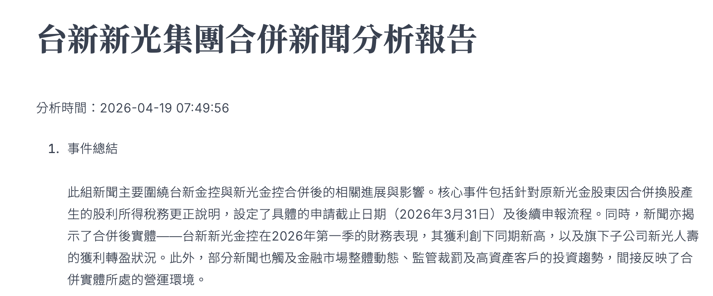

### 自動化 AI 分析：台新新光集團併購分析

```markdown
## 🏛️  News Intelligence System

- 台新新光集團合併新聞分析報告
- 從多個來源台新官網、中央社新聞抓取資訊，利用 Gemini 2.5 Flash 進行摘要分析，最後產出一份 HTML 報告。
- 導入了 CI/CD 自動化工作流，利用 GitHub Actions 追蹤每日 UTC+8 8:00 自動化執行抓取新聞資料、整合文章分析、自動上傳分析報告至Github。

## 🌟 核心功能

- 多源資料整合：自動合併爬蟲檔案。
- 自動化提示詞管理：一次處理 5-10 篇新聞，節省 API 額度並進行跨篇章對比。
- 安全性設計：金鑰與程式碼分離，透過 `.env.secret` 嚴密保護 API Key。


## 📁 檔案結構

.
├── .github/workflows/
│   └── daily_news.yml           # GitHub Actions 自動化排程腳本
├── doc/                         # 報告與爬蟲資料輸出目錄
│   ├── analysis_report.html     # 最終生成的視覺化報告
│   ├── analysis_report.md       # AI 生成的原始分析文件
│   ├── cna_news_wen58.csv       # 中央社新聞爬蟲結果
│   └── taishin_news_wen58.csv   # 台新官網爬蟲結果
├── src/                         # 程式碼目錄
│   ├── config/
│   │   └── prompt.yaml          # AI 指令、模型參數與範本
│   ├── api_connect.py           # API 連線與呼叫處理模組
│   ├── main.py                  # 主執行程式：抓取、合併、呼叫 API
│   ├── make_html.py             # 轉檔程式：Markdown 轉 HTML
│   └── search_news.py           # 新聞爬蟲模組
├── .env.secret.example          # 環境變數設定範本
├── .gitignore                   # Git 忽略檔案清單
├── README.md                    # 專案說明文件
└── requirements.txt             # 專案套件依賴清單
```

### 1. 環境準備
安裝 Python 3.10+，並建議使用虛擬環境：
```bash
python3 -m venv .venv
source .venv/bin/activate # On Mac
pip install -r requirements.txt
```

### 2. 設定金鑰
建立 `.env.secret.example`，並寫入個人.env.secret 並寫入 Google AI API Key：
```text
GEMINI_API_KEY=YOUR_API_KEY_HERE
```

### 3. 配置指令
編輯 `prompt.yaml` 來調整 AI 的分析語氣或角色設定。

### 4. 執行分析
```bash
python3 main.py
```

### 5. 報告產出
利用Gemini 2.5 Flash 進行摘要分析產出doc/analysis_report.html的分析報告。
* **事件總結**：精煉當日核心金融新聞，去除冗餘雜訊。
* **進度追蹤**：鎖定特定金控併購、法說會或重大案件之最新動態。
* **風險與機會**：AI 深度剖析市場潛在威脅與投資/佈局契機。

### 6. 產出結果
* [查看最新 AI 分析報告](./doc/analysis_report.html)
* [原始爬蟲資料 - 台新官網](./doc/taishin_news_wen58.csv)
* [原始爬蟲資料 - 中央社新聞](./doc/cna_news_wen58.csv)


## 🛠️ 開發套件

- `google-genai`：Gemini 2.5 模型對接
- `pandas`：高效能數據合併與處理
- `python-dotenv`：安全環境變數讀取
- `markdown`：分析報告格式轉換

---